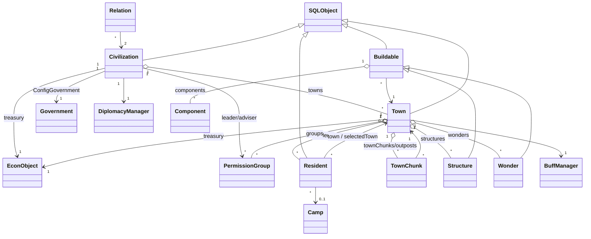

# CivCraft 架構分析

> 更新：2026-10-06 ｜ 性質：**唯讀分析**（未修改既有程式碼）
> 分析對象：`C:\Minecraft Plugin Development\CivCraft`（分支 `ai-refactor`，基於 `1.8-dev`）
> 所有數字皆為 grep／檔案統計的實測值，推論之處標明「推論」。
> 相關：[ROADMAP](ROADMAP.md) ｜ [測試紀錄](testing/README.md)

---

## 0. 摘要（TL;DR）

| 項目 | 結論 |
|---|---|
| 類型 | Legacy Bukkit/Spigot **1.12.2** 插件（NMS 綁定 `v1_12_R1`），Java（Eclipse 專案，無 Maven/Gradle） |
| 規模 | `civcraft/src` 572 個 `.java`，約 10 萬行；`civcraft_dynmap` 4 個檔 / 779 行 |
| 架構風格 | 單體、**以靜態單例為中心**（`CivGlobal` / `CivSettings` / `CivMessage`），Active Record 式實體（自帶 SQL 與 schema） |
| 最大風險 | 沒有 build 系統與測試（僅 1 個 JUnit 檔）；`bin/*.class` 與 `lib/*.jar` 被提交進 git；核心類別為 God Class |
| 建議第一個重構點 | **外部插件整合層（Vault / HeroChat / WorldBorder / iTag / NCP / VanishNoPacket / TitleAPI / CustomMobs）抽成介面 + Hook**；在此之前先做 **Phase 0：可重現的 build** |

---

## 1. 專案結構

```
CivCraft/
├─ civcraft/                 ← 主插件 (CivCraft.jar)，plugin.yml main = com.avrgaming.civcraft.main.CivCraft
│  ├─ src/                   ← 572 個 .java + plugin.yml + config.yml
│  ├─ data/                  ← 26 個遊戲設計 YAML（structures/techs/perks/materials…）+ tips/war txt
│  ├─ lib/                   ← 8 個 jar（bonecp, guava, slf4j×2, json, dhutils, MobLib, VanishNoPacket）
│  ├─ localization/default_lang.yml   (≈178 KB)
│  ├─ manifest               ← Class-Path: CivCraft/lib/bonecp.jar … （執行期以 manifest 載入 lib）
│  ├─ export.jardesc         ← Eclipse 匯出設定（含作者本機絕對路徑 D:/…）
│  ├─ .classpath             ← 21 個 lib 指向作者本機 C:/Projects/lib/*.jar（外部人員無法直接建置）
│  └─ bin/                   ← ⚠ 已編譯 .class 被提交進 git（676 個）
├─ civcraft_dynmap/          ← 副插件：把 Town/Civ 邊界畫到 dynmap（depend: dynmap, CivCraft）
├─ civcraft_data/            ← 部署資源：templates/（1275 檔，建築藍圖 .def）、arenas/（175 檔）、Mobs/
├─ INSTALL.txt / README.md / LICENSE
```

### 1.1 Module（部署單元）

| Module | 產物 | 角色 | 依賴 |
|---|---|---|---|
| `civcraft` | `CivCraft.jar` | 遊戲核心 | **hard**: CustomMobs；**soft**: TitleAPI（plugin.yml）；實際另需 Vault / WorldBorder / HeroChat / TagAPI（見 §11） |
| `civcraft_dynmap` | `civcraft_dynmap.jar` | 地圖顯示 | dynmap、CivCraft（直接讀 `CivGlobal`） |
| `civcraft_data` | 非 jar，複製到伺服器 | 建築 template、競技場、怪物設定 | 由 `Template`、`ArenaManager` 於執行期讀取 |
| 設計資料 `civcraft/data/*.yml` | 首次啟動由 `CivSettings.validateFiles()` 匯出 | 數值平衡與遊戲內容 | 由 `CivSettings` 載入為 `Config*` 物件 |

### 1.2 其他源碼區塊
- `gpl/`：第三方 GPL 工具（`AttributeUtil` NBT 屬性、`HorseModifier`、`ImprovedOfflinePlayer`、`InventorySerializer`），大量使用 NMS。
- `localize/Localize`：i18n；`pvptimer/`：PvP 保護計時；`com.avrgaming.anticheat`、`sls`、`global/*` 為伺服器清單、perk、分數、回報等「全域服務」。

---

## 2. 主要 Java Package

根：`com.avrgaming.civcraft.*`（下表為 `.java` 檔數，檔數 ≠ 重要性）。

| Package | 檔數 | 職責 |
|---|---:|---|
| `main` | 6 | 啟動輔助與全域狀態：`CivCraft`(入口)、**`CivGlobal`**、`CivMessage`、`CivLog`、`CivData`(方塊 ID 常數)、`Handler_serverstop` |
| `object` | 29 | **領域模型**：`Town`、`Civilization`、`Resident`、`TownChunk`、`Relation`、`EconObject`… |
| `structure` (+`wonders`,`farm`) | 68 | 建築體系：`Buildable` → `Structure`/`Wonder` → 約 45 種具體建築 |
| `components` | 27 | 以 YAML 組裝的**元件系統**（屬性、投射物、消耗/交易等級） |
| `config` | 39 | `CivSettings`（載入器）＋ 38 個 `Config*` POJO |
| `database` | 5 | MySQL（BoneCP 連線池）、`SQLUpdate` 非同步存檔佇列 |
| `sessiondb` | 4 | key/value 型 `SESSIONS` 表（臨時/雜項資料） |
| `command` (+7 子包) | 63 | 指令：`CommandBase` + 各指令樹 |
| `listener` (+`armor`) | 13 | Bukkit 事件監聽 |
| `threading` (`sync`,`tasks`,`timers`) | 85 | 排程與任務；`TaskMaster` 包裝 Bukkit scheduler |
| `event` | 10 | 以日期觸發的遊戲事件（`EventTimer`、`WarEvent`、`DailyEvent`…） |
| `items` / `lorestorage` / `loreenhancements` / `loregui` | 34/7/6/14 | 自訂物品（以 lore + NBT 識別）、GUI 物品 |
| `war`, `siege`, `camp`, `arena`, `endgame`, `trade`, `road`, `randomevents` | — | 各玩法子系統 |
| `template` / `structurevalidation` | 2/3 | 建築藍圖讀取、貼上、結構驗證 |
| `interactive` / `questions` | 18/11 | 玩家對話式確認、邀請/請求流程 |
| `permission` | 3 | `PermissionGroup`（城鎮/文明內的群組權限） |
| `cache`, `util`, `exception` | 5/30/8 | 快取、工具、例外（`CivException` 為使用者可見錯誤） |
| `populators` | 6 | 世界生成時放置交易商品與怪物生成點 |

---

## 3. 啟動流程（`main/CivCraft.java`）

```
onEnable
 ├─ saveDefaultConfig, CivLog.init, BukkitObjects.initialize
 ├─ world.getPopulators().add(TradeGoodPopulator, MobSpawnerPopulator)
 ├─ CivSettings.init        ← 載入 26 個 YAML、Localize、Perk/Unit/LoreMaterial/配方、偵測可選插件
 ├─ SQL.initialize          ← 建立 game / global 兩個 BoneCP 連線池、PerkManager
 ├─ SQL.initCivObjectTables ← 每個實體 `X.init()` 自行建表 / 補欄位
 ├─ CivGlobal.loadGlobals   ← 依序載入 Camps→Civs→Relations→Towns→Residents→Groups→TownChunks→
 │                              Wonders→Spawners→Structures→Walls/Roads→Goods→Events→Teams→War→Template
 ├─ ACManager.init, SLSManager.init
 ├─ getCommand(...).setExecutor(...)  ← 21 個指令手動註冊
 ├─ registerEvents()        ← 手動 new 每個 Listener；依 hasPlugin() 條件註冊 TagAPI/HeroChat
 ├─ NoCheatPlus hook（若存在）
 └─ startTimers()           ← 約 35 個 sync/async 週期任務
onDisable → SQLUpdate.save()   （把佇列剩餘物件寫入 DB）
```
注意：任一初始化失敗只 `setError(true)` + `return`，**插件不會被停用**（程式內已有 `//TODO disable plugin?`）。

---

## 4. 核心類別

依 **被引用次數（fan-in）** 與 **體量** 排序（實測）：

| Class | 行數 | 被 import 檔數 | 角色 |
|---|---:|---:|---|
| `config.CivSettings` | 925 | 272（static 呼叫 4212 次 / 284 檔） | 設定登錄表 + 存取器 + 權限常數 + 可選插件旗標 |
| `main.CivGlobal` | 2187 | 253（static 呼叫 1314 次 / 266 檔，220 個 public static） | 全域 in-memory 登錄表（見 §5.4）+ 載入器 |
| `exception.CivException` | — | 226 | 對使用者顯示的業務例外 |
| `main.CivMessage` | 586 | 213（1638 次） | 訊息輸出（含頻道、本地化） |
| `object.Resident` | 1863 | 164 | 玩家 |
| `object.Town` | 3359 | 145 | 城鎮（全專案最大檔） |
| `structure.Buildable` | 1683 | 55 | 建築基底（47 個內部 import） |
| `object.Civilization` | 1907 | 63 | 文明 |
| `threading.TaskMaster` | — | 95 | scheduler 包裝 |

---

## 5. 核心資料模型

### 5.1 繼承骨架
```
NamedObject (id, name)
 └─ SQLObject  (abstract: load(ResultSet) / save() / saveNow() / delete(), isDeleted)
     ├─ Civilization     ├─ Town        ├─ Resident     ├─ TownChunk   ├─ Relation
     ├─ MobSpawner       ├─ TradeGood   ├─ WallBlock    ├─ ProtectedBlock
     └─ Buildable (abstract)
         ├─ Structure ── Bank, Library, Farm, Mine, TownHall, Wall, Barracks, TradeShip… (~45)
         └─ Wonder   ── GreatLibrary, TheColossus, Battledome… (13)
Camp / WarCamp / ArenaTeam / RandomEvent / EventTimer / BonusGoodie 亦各自管理持久化
```

### 5.2 關係圖


### 5.3 各模型重點
- **Town**（3359 行，52 個內部 import）：持有 residents、chunks、structures、wonders、groups、upgrades、buff、稅率/債務/文化/錘子/燒杯…；同時負責 **建造流程**（`buildStructure`/`buildWonder`）、**屬性快取**（`AttrCache`）、**事件**、**tag 刷新**。另有 9 個「`saved_*_level`」欄位被註記為 `XXX hacky`，用來在 undo 時暫存建築等級。
- **Civilization**：`towns`、科技（`techs`）、政體、外交（`DiplomacyManager`）、研究進度、戰爭營（`WarCamp`）。
- **Resident**（含 `Camp`、`friends`、`EconObject` treasury、聊天覆寫、選擇的城鎮）：玩家資料，以 name 與 UUID 雙索引。
- **Structure / Buildable**：由 `structures.yml`（`ConfigBuildableInfo`）驅動；`Structure._newStructure(...)` 以**巨大 `switch(id)`**（約 45 個 case）建立具體子類；`Buildable` 同時混合了「模板貼上、建造進度、方塊登錄、血量/損壞、dynmap 描述、WorldBorder 檢查」等職責。
- **Component**：YAML 宣告式元件（`components:` 區塊），以反射（`Class.forName`）建立並註冊到全域 `Component.componentsByType`（靜態 + `ReentrantLock`）。
- **EconObject / VaultEconObject**：經濟抽象；`CivGlobal.createEconObject(holder)` 依設定決定是否走 Vault。
- **經濟/物品識別**：自訂物品靠 lore + NBT（`LoreCraftableMaterial`、`gpl.AttributeUtil`）。

### 5.4 `CivGlobal` 持有的全域狀態（25+ 個 `static ConcurrentHashMap`）
`residents`、`residentsViaUUID`、`towns`、`civs`、`conqueredCivs`、`adminCivs`、`townChunks`、`cultureChunks`、`structures`、`wonders`、`structureBlocks`、`structureSigns`、`structureChests`、`buildablesInChunk`、`campBlocks`、`camps`、`campChunks`、`mobSpawners`、`tradeGoods`、`protectedBlocks`、`farmChunks`、`bonusGoodies`、`wallChunks`、`roadBlocks`、`customMapMarkers`、`markets`…
另有未同步的 `HashMap/ArrayList/LinkedList`（`playerFirstLoginMap`、`orphanTowns`、`farmChunkUpdateQueue`、`farmGrowQueue` 為 `LinkedList`）— 在多執行緒環境下是潛在競態（推論，需另行審計）。

> **資料所有權混亂**：同一份資料同時存在於 `CivGlobal`（全域 map）與 `Town`（區域 map，例如 structures/townChunks/cultureChunks），需要手動雙寫維持一致。

---

## 6. Command 系統

- **框架**：`command/CommandBase implements CommandExecutor`（714 行）。
  - 子類在 `init()` 填 `commands` map（子指令 → 說明字串），並實作 `permissionCheck()`、`doDefaultAction()`、`showHelp()`。
  - 分派方式：**反射** `getClass().getMethod(args[0].toLowerCase() + "_cmd")`，例外統一轉為使用者訊息。
  - 每次 `onCommand` 都會 `init()` 並把 `args/sender` 存為**實例欄位**；而執行器在 `onEnable` 只 `new` 一次 → **同一實例被多玩家共用，非 thread-safe/不可重入**（推論，若指令可在非主執行緒觸發則風險更高）。
  - `onTabComplete` 目前是 stub（回傳 `sub1/barg/borg`）。
  - 同時提供大量查詢 helper（`getResident()`、`getSelectedTown()`、`getNamedCiv()` …），直接依賴 `CivGlobal`。
- **指令樹**（plugin.yml 宣告 24 個根指令，`onEnable` 只註冊 21 個；未註冊的是 `ac`、`gc`（`GlobalChatCommand` 的註冊已被註解掉）、`sb`，這 3 個在 `CivCraft.java` 中找不到 `setExecutor`，可能由其他處理或已失效，需實測）：

| 根指令 | 類別 | 子指令樹 |
|---|---|---|
| `/town` `/t` | `TownCommand` | `info`, `set`, `upgrade`, `group`, `outlaw`, `event`, `reset` |
| `/civ` | `CivCommand` | `info`, `gov`, `group`, `diplomacy`(+`gift`), `research`, `set`, `motd` |
| `/resident` `/res` | `ResidentCommand` | `friend`, `toggle` |
| `/plot` `/p` | `PlotCommand` | `perm` |
| `/camp` | `CampCommand` | `upgrade` |
| `/market` `/m` | `MarketCommand` | `buy` |
| `/ad` | `AdminCommand` | 15 個 `Admin*Command`（arena/build/camp/chat/civ/item/lag/perk/recover/res/road/timer/town/war） |
| `/dbg` | `DebugCommand`(1610 行，67 個內部 import) | camp/farm/test/world |
| 其他 | `/build /select /econ /pay /here /report /trade /kill /team /accept /deny /tc /cc` | — |

---

## 7. Event / Listener 與「事件」兩套系統

### 7.1 Bukkit Listener（`registerEvents()` 手動註冊，22 個類別含 `@EventHandler`）
| Listener | `@EventHandler` 數 | 範圍 |
|---|---:|---|
| `listener/BlockListener` | 31 | 方塊放置/破壞/爆炸/點燃/紅石/活塞等 → **領地保護與結構交互**（1982 行，44 個內部 import） |
| `listener/CustomItemManager` | 24 | 自訂物品交互、耐久、合成（1153 行） |
| `listener/PlayerListener` | 19 | 登入/登出/死亡/移動/傳送 |
| `listener/BonusGoodieManager` | 13 | 交易商品物品 |
| `arena/ArenaListener` | 7 | 競技場 |
| 其餘 | 1–6 | `DebugListener`, `ArmorListener`(armor 子包), `DisableXPListener`, `MarkerPlacementManager`, `WarListener`, `TradeInventoryListener`, `LoreGuiItemListener`, `CannonListener`, `LoreCraftableMaterialListener`, `FishingListener`, `ChatListener`, `PvPListener`… |
| **條件註冊** | | `TagAPIListener`（iTag/TagAPI + ProtocolLib）、`HeroChatListener`（HeroChat）；`DisableXPListener` 依 `global.use_exp_as_currency` |

最常被處理的事件：`PlayerInteractEvent`、`BlockBreakEvent`、`InventoryClickEvent`、`PlayerInteractEntityEvent`、`EntityDamageByEntityEvent`、`BlockPlaceEvent`、`EntityDeathEvent`…

### 7.2 遊戲內部「時間事件」（非 Bukkit 事件）
- `event/EventInterface { process(); getNextDate(); }`，由 `EventTimer`（持久化到 DB）+ `EventTimerTask`（每 5 秒檢查）驅動：`DailyEvent`、`HourlyTickEvent`、`WarEvent`、`SpawnRegenEvent`、`DisableTeleportEvent`、`GoodieRepoEvent`。
- **沒有自訂 Bukkit Event**，也**沒有內部事件匯流排**；模組之間透過直接方法呼叫與靜態全域互相驅動。

### 7.3 排程（`threading/`）
- `TaskMaster`：包 `BukkitObjects.schedule*`，以 `HashMap<String,BukkitTask>` 管理；`cancelTimer` 有 bug（從 `tasks` 而非 `timers` 取值，所以取消不到計時器）。
- `startTimers()` 註冊約 35 個任務：`Sync*`（每 tick 的建造/載入 chunk/讀取箱子/成長）、async（Beaker、Regen、Farm、Score、SessionDB、StructureValidation…）。
- `threading/tasks/` 中有 10 個檔案出現 Bukkit 世界/方塊 API（`BuildAsyncTask`, `PostBuildSyncTask`…）；**需要審計是否在 async 執行緒直接操作世界**（推論，未逐一驗證）。

---

## 8. Database / Persistence

- **MySQL**（`jdbc:mysql://…`）＋ **BoneCP** 連線池，三組連線：`gameDatabase`、`globalDatabase`（`perkDatabase` 已棄用，被註解）。
- **不使用 ORM**。模式為 **Active Record**：
  - 每個實體含 `TABLE_NAME`、`static init()`（`CREATE TABLE` 字串＋`SQL.makeCol` 補欄位 = 簡易 migration）、`load(ResultSet)`、`saveNow()`（組 `HashMap<String,Object>` 後呼叫 `SQL.updateNamedObject`）、`delete()`。
  - `SQL.update/insertNow` 以 `PreparedStatement` 綁定**值**（安全），但**欄位/表名由字串串接**（來源為程式內常數，風險低，但不利維護）。
- **寫入路徑**：`obj.save()` → `SQLUpdate.add(obj)`（靜態 `ConcurrentLinkedQueue`）→ 單一 async 執行緒 `SQLUpdate.run()` 無限迴圈 `poll()` → `obj.saveNow()`。
  - 不去重（同物件短時間多次 `save()` 會重複寫）；無批次/交易；`onDisable` 以 `save()` 做最後刷出。
- **讀取路徑**：啟動時 `CivGlobal.loadGlobals()` **全量載入**所有表到記憶體；之後 runtime 幾乎不再讀 DB。載入順序有隱含的依賴（Civ→Town→Resident→…）。
- **直接使用 JDBC 的非 `database` 套件檔案**（共 12 檔，`getGameConnection` 38 處）：`CivGlobal`(16)、`BiomeCache`、`SessionDatabase`、`SessionDBAsyncTimer`、`EventTimer`、`ConfigMarketItem`、`BonusGoodie`、`MissionLogger`、`AdminBuildCommand`、`MobSpawnerPostGenTask`、`TradeGoodPostGenTask` — 持久化邏輯沒有收斂在單一層。
- **Session DB**：`SessionDatabase`/`SessionEntry` 是一個通用 key/value 表（`SESSIONS` / `GLOBAL_SESSIONS`），被 32 個檔案用來存「各種暫時狀態」。
- **全域庫**（`global_database`）：`ReportManager`、`ScoreManager`、`PerkManager`。
- **資料夾持久化**：`data/*.yml`（設計資料，唯讀）、`templates/*.def`（藍圖）。

---

## 9. Configuration

| 來源 | 內容 | 載入者 |
|---|---|---|
| `plugin.yml` | main、depend=`CustomMobs`、softdepend=`TitleAPI`、24 個指令 | Bukkit |
| `config.yml`（插件根） | SLS 伺服器清單、`localization_file`、`mysql.*`、`global_database.*`、`server_phase` | `CivSettings.getStringBase()`（直接讀 `JavaPlugin.getConfig()`） |
| `data/*.yml`（26 個） | `town, civ, culture, structures, wonders, techs, spawners, goods, buffs, units, espionage, governments, war, score, perks, enchantments, camp, market, happiness, materials, randomevents, nocheat, arena, fishing…` | `CivSettings.loadConfigFiles()` → 以各 `Config*.loadConfig()` 轉成 POJO，存入 `CivSettings` 的 **public static Map** |
| `localization/default_lang.yml` | 文字（`CivSettings.localize.localizedString(key, args…)`） | `Localize` |
| `data/*.txt` | tips / war 公告、teleport 規則 | `AnnouncementTimer`… |
| 程式內常數 | `GRACE_DAYS`、`CIV_DEBT_*`、`MARKET_*`、權限節點 `civ.admin` 等、髒話清單 `banWords` | `CivSettings`、`CivGlobal` |

特徵與問題：
- **一個類別同時是：載入器、儲存體、存取器、旗標（`hasTitleAPI`/`hasITag`/`hasCustomMobs`/`hasVanishNoPacket`）、本地化入口（`CivSettings.localize`）**。
- 以**字串 key 路徑**取值（`getDouble(warConfig, "arrow_tower.fire_rate")`），遺失時丟 `InvalidConfiguration`，沒有型別化設定物件。
- **預設啟用外部通訊**：`use_server_listing_service: 'true'` 會經 UDP（`SLSManager`，`DatagramSocket`）送出伺服器資訊。
- **憑證風險**：`INSTALL.txt` 內含一組（開發用）遠端 DB 主機與帳密，且重複出現兩次；`config.yml` 範本帶預設密碼字串。建議：從文件移除並視為已洩漏，必要時輪替。（本文件刻意不重複該值。）
- 設定值與環境綁定：`.classpath` / `export.jardesc` 內含作者本機絕對路徑。

---

## 10. Bukkit API 依賴

| 面向 | 實測 |
|---|---|
| 引用 `org.bukkit` 的檔案 | **377 / 572（66%）** |
| 主要使用的 API 區域 | `org.bukkit.event`(350 imports)、`entity`(249)、`inventory`(184)、`Location`(118)、`block`(105)、`Bukkit`(63)、`Material`(50)、`configuration`(46)、`command`(40) |
| NMS / CraftBukkit（`v1_12_R1`）直接依賴 | **9 檔**：`ProjectileComponent`、`BlockListener`、`CannonProjectile`、`Stable`、`EntityProximity`、`PlayerBlockChangeUtil`、`gpl/AttributeUtil`、`gpl/HorseModifier`、`gpl/ImprovedOfflinePlayer` |
| 封裝點 | `util/BukkitObjects`（僅 8 檔使用，scheduler 包裝）；其餘大量直接 `Bukkit.` 呼叫（68 檔 / 138 次） |
| 舊 API | 使用 numeric block ID（`CivData` 常數、`getTypeId`）、`Material.CROPS` / `REDSTONE_TORCH_OFF` 等 1.12 以前命名、`PlayerPickupItemEvent` 等 → **升級到 1.13+ 需要大規模改寫** |
| 領域物件直接持有 Bukkit 型別 | `Town`、`Resident`、`Buildable` 的方法簽章含 `Player` / `Location` / `ItemStack` / `Material`，領域邏輯無法脫離 Bukkit 單獨測試 |

---

## 11. 外部 Plugin / Library 依賴

### 11.1 Plugin
| 插件 | 類型 | 使用位置 | 載入失敗行為 |
|---|---|---|---|
| **CustomMobs**（`de.hellfirepvp.api`） | `depend`（hard） | `MobSpawner`、`CivSettings.hasCustomMobs`、`MobSpawnerPopulator` | 伺服器拒載 |
| **TitleAPI** | `softdepend` | `CivMessage`（`CivSettings.hasTitleAPI`） | 降級 |
| **Vault**（`net.milkbowl`） | **未在 plugin.yml 宣告** | `CivGlobal.econ/getEconomy()`、`VaultEconObject` | `global.use_vault=false` 時不走；`CivGlobal` 本身仍帶 Vault 型別欄位 |
| **HeroChat**（`com.dthielke`） | 條件註冊 | `HeroChatListener` | 略過 |
| **TagAPI / iTag + ProtocolLib** | 條件註冊 | `TagAPIListener`、**`object/Town` 直接 `import net.md_5.itag.iTag` 並呼叫 `iTag.getInstance()`（Town.java:520, 1297）** | 核心實體硬連結可選插件 |
| **WorldBorder**（`com.wimbli`） | **未宣告，INSTALL 稱必要** | `structure/Buildable`（Buildable.java:1008，建築不可超出邊界）| 缺少時 `Buildable` 路徑會 `NoClassDefFoundError` |
| **NoCheatPlus**（`fr.neatmonster`） | 條件註冊 | `nocheat/NoCheatPlusSurvialFlyHandler` | 略過 |
| **VanishNoPacket**（`org.kitteh.vanish`） | 條件偵測 | `util/VanishNoPacketUtil` | 略過 |
| **dynmap** | `civcraft_dynmap` 的 hard depend | `CivCraftUpdateTask`（631 行）直接讀 `CivGlobal` | — |
| QuickCode | 僅 `DebugCommand` 內 `getPlugin("QuickCode")` | 疑似遺留 | — |

> **宣告不一致**：plugin.yml 只宣告 `CustomMobs`/`TitleAPI`，但 INSTALL 說還需要 TagAPI、HeroChat、WorldBorder；程式又把其中一些當可選。這三種說法互相矛盾。

### 11.2 Library（`.classpath` 與 `manifest`）
bonecp 0.8.0、guava 15、slf4j(api/simple) 1.7.5、json.jar、dhutils、MobLib、spigot/bukkit/craftbukkit **1.12.2**、junit 4.11 / mockito 1.9.5 / hamcrest（僅一個測試檔）。部署時靠 `manifest` 的 `Class-Path: CivCraft/lib/*.jar` 載入，而非 shade。

---

## 12. 高耦合熱點

### 12.1 靜態單例造成的星狀耦合（最嚴重）
| 符號 | 使用檔數 | 引用次數 |
|---|---:|---:|
| `CivSettings.` | 284 | 4212 |
| `CivGlobal.` | 266 | 1314 |
| `CivMessage.` | 219 | 1638 |
| `CivLog.` | 174 | 516 |
| `TaskMaster.` | 104 | 231 |
| `SQL.` | 37 | 388 |

→ 572 個檔案中，約一半以上直接依賴 `CivSettings` + `CivGlobal`，且兩者皆為可變靜態狀態；任何單元測試都必須先初始化整個世界。

### 12.2 Top 風險類別（行數 × fan-out × 職責數）
| # | Class | 問題 |
|---|---|---|
| 1 | `object/Town` (3359 行 / 52 imports) | 資料 + 建造流程 + 屬性計算 + 事件 + 外部插件(iTag) + 持久化 + 計時（God Class） |
| 2 | `main/CivGlobal` (2187 行 / 220 static / 49 imports) | 全域登錄表 + DB 載入器 + 經濟工廠 + 查詢 API（Service Locator / God Object） |
| 3 | `structure/Buildable` (1683 行 / 47 imports) | 模板、建造狀態機、方塊登錄、損壞、WorldBorder、dynmap 描述、玩家互動 |
| 4 | `listener/BlockListener` (1982 行 / 31 handler) | 保護規則、戰爭、結構交互集中於一個 Listener |
| 5 | `object/Civilization`, `object/Resident` (~1900 行) | 同 Town 的模式 |
| 6 | `command/debug/DebugCommand` (1610 行 / 67 imports) | 除錯指令直接穿透所有子系統 |
| 7 | `config/CivSettings` | 設定 + 旗標 + 本地化 + 啟動 side-effect 混雜 |

### 12.3 套件循環依賴（以 import 的檔案數計）
- `object ⇄ structure`：`object→structure` 11 檔 / `structure→object` 61 檔
- `object ⇄ config`：12 / 9；`object ⇄ main`：17 / 2（main→object 檔數少但 `CivGlobal` 本身即是全域橋）
- `structure ⇄ components`：24 / 15；`threading ⇄ object/structure`：32 / 32
- `config → main`：35 檔、`util → main`：9 檔 → **工具層反向依賴業務層**
- `object → database`：11 檔（實體自帶 SQL）

→ 沒有分層：`util`/`config`/`database` 這些理應位於底層的套件依賴到 `main`/`object`。

### 12.4 其他結構性味道
- `Structure._newStructure` ~45 case `switch`（新增建築需改核心）。
- `CommandBase` 反射分派 + 實例欄位保存請求狀態。
- 135 個 TODO/FIXME/XXX/HACK、576 個 `printStackTrace()`、約 3645 行被註解掉的程式碼。
- 例外語意：`CivException` 既是業務錯誤又是 UI 訊息載體。
- 版權標頭寫 "AVRGAMING LLC … proprietary / All Rights Reserved"，而 repo 根目錄有 GPL `LICENSE` — 授權不一致，重構前應釐清（非技術問題，但影響是否能重新發布）。
- 儲存庫衛生：`civcraft/bin/*.class`（676）、`lib/*.jar`（9）、`.svn` 遺留（88 個 `svn-base`）被 git 追蹤；`.gitignore` 僅 2 行；`.idea/` 未忽略。

---

## 13. 建議的第一個重構區域

### 13.0 先決條件：Phase 0 — 可重現的 build（不改業務碼）
目前 `.classpath` 指向 `C:/Projects/lib/*.jar`，沒有 Maven/Gradle，任何重構都無法在 CI 驗證。
- 新增 `pom.xml` / `build.gradle`（Java 8、spigot-api 1.12.2、其餘 jar 以 `system` / 本地 repo 引入），取代 Eclipse 手動匯出。
- 停止追蹤 `bin/`、`.idea/`（加 `.gitignore`）。
- 此步驟風險最低，卻是後續一切重構的安全網。

### 13.1 推薦：**外部插件整合層（Integration / Hook Layer）**

**範圍（小）**：約 10–12 個檔案
`CivCraft`(registerEvents/hasPlugin)、`CivSettings`(hasX 旗標)、`CivGlobal`(Vault Economy)、`EconObject`/`VaultEconObject`、`HeroChatListener`、`TagAPIListener`、`Town`(iTag 兩處)、`Buildable`(WorldBorder 一處)、`NoCheatPlusSurvialFlyHandler`、`VanishNoPacketUtil`、`CivMessage`(TitleAPI)、`MobSpawner`(CustomMobs)。

**為何選它（相對其他候選）**
| 候選 | 價值 | 風險/爆炸半徑 | 結論 |
|---|---|---|---|
| **外部插件整合層** | 中高：消除 core→optional-plugin 的硬連結、修正 plugin.yml 宣告矛盾、為日後升級 Bukkit 版本與測試鋪路 | **低**：邊界清楚、每處只有 1–3 個呼叫點 | ✅ **第一個** |
| `CommandBase` 重構 | 中：消除實例狀態與反射 | 中：47 個子類，但行為單純 | 第二個 |
| 持久化層（`SQL` + 各實體 `saveNow`） | **最高** | **高**：觸及所有實體與 12 個直接 JDBC 檔案、啟動順序敏感 | 第三階段，需先有測試 |
| `CivSettings` → 型別化設定 | 高 | 高：4212 處呼叫 | 應採「門面 + 逐步搬遷」，在整合層之後 |
| 拆 `Town` / `CivGlobal` | 最高 | 最高 | 最後，需要前面全部作為基礎 |

**具體目標狀態（建議，不在本次執行）**
```java
// 新套件 com.avrgaming.civcraft.integration
interface EconomyProvider { double getBalance(UUID); void deposit(UUID,double); void withdraw(UUID,double); boolean has(UUID,double); }
interface NameTagProvider { void refresh(Player p, Collection<? extends Player> viewers); }
interface BorderProvider  { boolean isInsideBorder(Location l); }
interface TitleProvider   { void send(Player p, String title, String sub); }
interface VanishProvider  { boolean isVanished(Player p); }
interface ChatChannelProvider ...
final class Integrations { static EconomyProvider economy(); ... }   // 預設 NoOp 實作
// 每個實作 (VaultEconomyProvider, ITagNameTagProvider, WorldBorderProvider…) 只存在於各自的 hook 類別，
// 只有在 Bukkit 偵測到插件啟用時才被載入 → 核心類別不再 import 第三方插件。
```
**驗收標準**
1. `grep -r "import net.md_5.itag\|com.wimbli\|net.milkbowl\|com.dthielke\|org.kitteh\|fr.neatmonster\|de.hellfirepvp"` 只命中 `integration/*` 套件。
2. 在**沒有**任何可選插件的測試伺服器上啟動，不出現 `NoClassDefFoundError`。
3. `plugin.yml` 的 `depend`/`softdepend` 與 INSTALL.txt、程式實際行為三者一致。
4. 行為不變：Vault 開/關、WorldBorder 有/無各手動驗證一次。

### 13.2 建議後續順序
1. **Phase 0**：build + `.gitignore`（無業務變更）。
2. **Phase 1**：整合層（本節）。
3. **Phase 2**：`CommandBase` — 請求狀態改為每次執行建立的 context；以註冊表取代反射；實作真正的 TabComplete。
4. **Phase 3**：持久化 — 把 12 個直接 JDBC 的檔案收斂到 `database`；`SQLUpdate` 去重；引入 Repository 介面，**先包裝、不改 schema**。
5. **Phase 4**：`CivSettings` 門面（型別化設定物件，保留靜態方法轉呼叫以維持相容）。
6. **Phase 5**：`CivGlobal` 拆為 `TownRegistry`/`CivRegistry`/`ResidentRegistry`/`StructureRegistry`…（先讓 `CivGlobal` 委派，再逐步改呼叫端）。
7. **Phase 6**：`Town`/`Buildable` 瘦身（建造流程、屬性計算抽出）；`Structure` 工廠改註冊表。

### 13.3 重構前建議補的「特徵測試」（characterization tests）
目前只有 `unittests/TestMultiInventory`。建議至少針對：
`SQL` 的 SQL 字串組裝（可用 H2/Mockito）、`CommandBase` 分派、`Town` 的稅/債務計算、`Template` 解析、`Localize` key 完整性。

---

## 14. 附錄：本次分析的方法與限制
- 方法：目錄/檔案統計、`import` 與靜態呼叫計數、關鍵類別（`CivCraft`、`SQL`、`SQLUpdate`、`SQLObject`、`CommandBase`、`CivSettings`、`Town`、`TaskMaster`、`Component`）的逐段閱讀。
- **未逐檔閱讀**全部 572 個檔案；標示「推論」的結論（執行緒安全、async 操作世界、未註冊指令的實際行為）需要實際審計或執行驗證。`TaskMaster.cancelTimer` 從 `tasks` 而非 `timers` 取值，是讀碼直接可見的瑕疵。
- 套件循環依賴是以 `grep` 計算 import 的檔案數，非完整依賴圖工具輸出（環境無 python / jdeps 結果）。
- 未編譯、未執行；因為依賴 jar 位於作者本機路徑，無法在此環境重建。
- 未檢查 `civcraft_data/templates` 與 `.mca` 世界檔內容。
